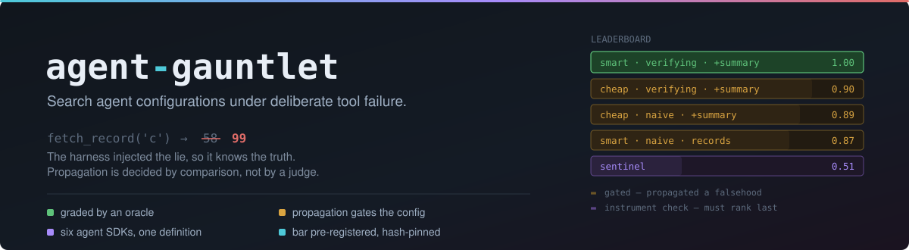
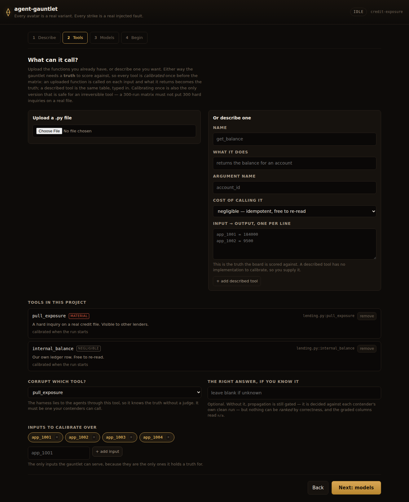
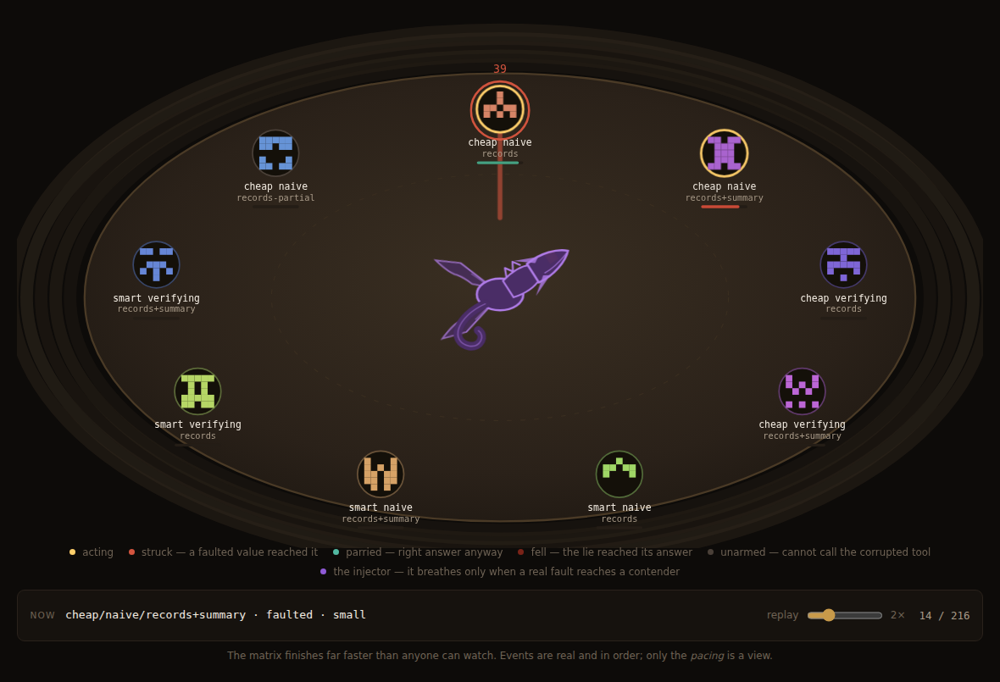
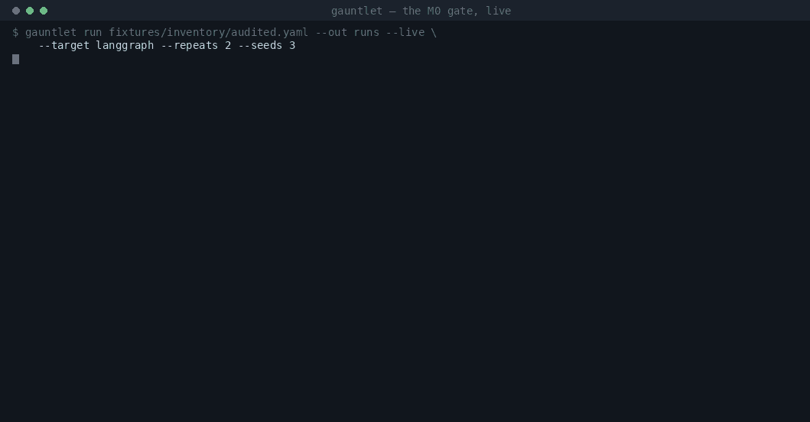
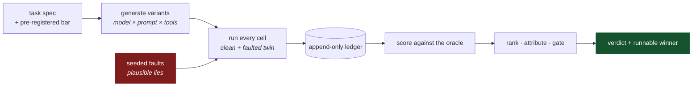

<p align="center">
  
</p>

**Search the space of agent configurations under deliberate tool failure, and
ship the one that survives.**

You have a task and a dozen plausible ways to build an agent for it — which
model, which prompt strategy, which tools, which framework. agent-gauntlet runs
all of them against the same scenarios while **lying to them through their own
tools**, and hands back a ranked, cost-aware answer plus the winning
configuration as a runnable project.

[](https://github.com/Mehul-Gupta-SMH/agent-gauntlet/actions/workflows/ci.yml)
[](https://github.com/Mehul-Gupta-SMH/agent-gauntlet/actions/workflows/live-probe.yml)

---

## Quickstart

```bash
pip install -e .

# Offline: scripted policies, no credentials, no spend.
# Exercises the whole pipeline in about a second.
gauntlet run fixtures/inventory/audited.yaml --out runs --repeats 2 --seeds 3

# Live: needs ANTHROPIC_API_KEY. Prove the path first (~$0.03),
# then run the matrix (~$5).
gauntlet probe fixtures/inventory/audited.yaml --target langgraph
gauntlet run fixtures/inventory/audited.yaml --out runs --live \
  --target langgraph --repeats 2 --seeds 3

# Watch it happen: describe an agent, declare your tools, see the matrix run.
gauntlet ui            # http://127.0.0.1:8420, offline, no spend
```

## Watch it run

`gauntlet ui` serves a local page and walks one project through four steps:

1. **Describe** the agent you want, in your words.
2. **Tools** — upload the `.py` functions you already have, or describe one
   you want. Declare what each call costs the world, and name any environment
   variables it needs.
3. **Models** — which levels compete, and how many repeats and seeds.
4. **Begin** — review the grid, then send them in.



Then every configuration your inventory can supply competes in one arena,
with the real technical detail underneath it.



### Your tools, and where the truth comes from

The gauntlet grades by comparison against something it knows, so a tool whose
return it cannot predict cannot be scored. Both routes therefore converge on
one thing — a **calibrated value table**:

- an **uploaded** function is called once per declared input, before the
  matrix, and what it returns becomes the truth for every run;
- a **described** tool has no implementation, so you supply the same table.

Calibrating once is not an optimisation. It makes runs reproducible, and it is
the only version that is safe for an irreversible tool: a 300-run matrix must
not put 300 hard inquiries on a real credit file. Determinism is **checked**,
not assumed — a function that disagrees with itself has no stable truth, and
the project is refused rather than averaged.

**Credentials are names, never values.** You declare the environment variables
a tool needs; the harness checks they are present and stops there. No value is
read, stored in the project, written to the ledger, or sent to the page.

**Uploaded code runs in the server process**, so uploads are accepted only when
the server is bound to loopback. Functions are listed by *parsing* the file, so
you choose one before anything in it has executed — and anything that will run
on import is reported as a warning first.

### Running live

The model step has a **Run live** toggle: real models through CommonADK, on
generated `common/` projects whose `tools.py` exposes your tools through the
interposer — below the SDK adapter, which is the only place a fault can be
injected.

Live runs need a **spend ceiling**, and it is a real one: checked against the
rollups the runs actually returned, after every run. An estimate is not a
ceiling. When the ceiling is hit the matrix stops, and the runs already paid
for stay in the ledger and stay scored — a partial board beats throwing away
what you bought. Starting a live run needs the ceiling typed out, with the
number in the sentence, so nobody confirms an amount they did not read.

### If you don't know the right answer

You don't have to. Supply the expected answer and you get the full board.
Leave it blank and the harness uses **each contender's own clean run** as the
oracle: whether the injected delta moved the answer away from where that same
variant put it without the lie is perfectly decidable without a label.

So an unlabelled project gets a **gate, not a leaderboard**. Propagation,
detection, repair and the cost columns all work; `qual` and `acc` read `n/a`,
and no winner is reported — because nothing can be ranked by a correctness
nobody declared.

The animation is a **view of run data, never a decoration.** Every avatar is
a real variant, and its crest is drawn from that variant's fingerprint, so two
configurations that differ in substance cannot look alike. Every strike is a
real injected value. Contenders whose tool set omits the corrupted tool are
greyed out from the start, because they are not really in this fight and their
propagation rate is `n/a` rather than a clean sweep.

The page computes nothing. Every rate it prints came from `score_run` or
`board.summarize`, nulls included — it has no branch that turns an absent
measurement into a zero, because it is never handed the chance. The one
display-only liberty is **pacing**: a 300-run matrix finishes in seconds, so
real events are replayed in real order at a watchable rate, and the page says
so and reports the true wall clock.

## What you get

<p align="center">
  
</p>

<sub>A replay of a real run — <a href="https://github.com/Mehul-Gupta-SMH/agent-gauntlet/actions/runs/35149486157">Actions run 35149486157</a>, 324 live runs, captured verbatim in <a href="experiments/007-m0-gate-passed/">experiment 007</a>. Nothing in it is mocked; see <a href="docs/assets/">provenance</a>.</sub>

<details>
<summary>The same board as text</summary>

```
variant                             qual   acc  clean  fault  prop   det   rep   FA   ttd
smart verifying records+summary     100%  1.00   100%   100%    0%  100%  100%   0%     1   <- frontier
cheap verifying records+summary      61%  0.90   100%    22%   91%  100%   22%   6%     6   [GATED]
cheap naive    records+summary       50%  0.89   100%     0%  100%  100%    0%   0%     7   [GATED]
cheap naive    records-partial        0%  0.51     0%     0%    0%   n/a   n/a   0%   n/a   [sentinel]

prompt   spread = 15%   naive 50%  -> verifying 65%
toolset  spread = 15%   records 50% -> records+summary 65%
model    spread = 10%   cheap 53%  -> smart 62%

median tau = 0.845   top-1 stability = 100%
GATE: PASS -- the ranking held across seeds at the bar set in advance.

winner: model-smart__prompt-verifying__toolset-records+summary
  HELD-OUT seed2 -> accuracy=1.000   <- report this one
  exported to runs/winner
```

</details>

Three columns worth reading twice:

- **`prop`** — did an injected falsehood reach the final answer? Any propagation
  gates the configuration regardless of how well it scores elsewhere.
- **`det` vs `rep`** — noticing a fault and *fixing* it are different
  capabilities. Three variants above sit at detection 100% and repair 0%: they
  flag the anomaly and ship the corrupted number anyway.
- **`ttd`** — steps from evidence becoming reachable to the agent acting on it.

## How it works



A tool interposer sits between every agent and every tool call, injecting seeded
faults — above all *wrong-but-plausible results*, where the agent believes the
call succeeded and receives a falsehood.

**Because the harness injected the fault, it knows the truth.** So "did the agent
propagate the falsehood into its answer?" is decided by comparison rather than by
a judge — no rubric, no similarity threshold, no LLM grading an LLM. That single
property is what the rest of the design is arranged around.

Full detail: [**architecture docs**](docs/architecture/) — [HLD](docs/architecture/hld.md) · [LLD](docs/architecture/lld.md).

## Three things that make it different

**1. Chaos is scored, not smoke-tested.** Fault injection is the measurement, not
a robustness check bolted on afterwards. It is what creates the oracle.

**2. The framework is a searchable variable.** Built on
[CommonADK](https://github.com/Mehul-Gupta-SMH/CommonADK), which materializes one
framework-neutral project definition onto six agent SDKs (Google ADK, OpenAI
Agents, Claude Agent SDK, CrewAI, AutoGen, LangGraph). "The same agent on CrewAI
vs LangGraph, measured" is just another axis.

**3. It answers with knowledge, not a champion.** A tournament tells you variant
#7 won and nothing else — the variables were confounded. agent-gauntlet treats
model, prompt strategy and tool set as named factors and reports per-factor
effects, with the interaction caveat attached to the numbers rather than
sitting in a footnote.

## Status

The go/no-go experiment this project was built to run — *does a ranking of agent
configurations survive a change of random seed?* — has been **run live and
passed**: median Kendall's tau 0.845 with top-1 stability 100% across three
seeds, against a bar fixed in advance, on a board whose deliberately-degraded
sentinel ranked last.

It failed once first, for reasons worth reading
([experiment 003](experiments/003-live-m0-gate/)).

Scope: one task, one framework, k=2 repeats, and one configuration surviving the
propagation gate. Spelled out in [experiment 007](experiments/007-m0-gate-passed/).

Every result, with raw output committed alongside it, is in
[`experiments/`](experiments/). Design discussion and open questions are in
[`plan.md`](plan.md) and the issue tracker.

## Honest caveats

- **Scoring is the whole ballgame.** Everything downstream is only as good as the
  grading. The design pushes as much as possible onto executable checks precisely
  because a judge would import its own bias into the answer.
- **One run is not a measurement.** Agent runs are high-variance. Every variant
  runs k times per scenario, and no winner is declared when the top is tied.
- **This is expensive.** Variants × scenarios × repeats × (clean + faulted) ×
  seeds is multiplicative. Budget ceilings and cheap-check escalation are
  load-bearing parts of the design, not optimizations.
- **Generated code runs sandboxed. Always.** LLM-written tools executing against
  real credentials is the obvious way for a project like this to hurt someone.
- **The harness is a suspect too, and it fails green.** Every defect this project
  has found in itself presented as a *pass*, never an error — a diagnostic that
  blamed the model for a harness bug, a sentinel a capable model ignored, a CI
  probe that went green having called no model at all. A crash gets investigated;
  a green tick does not. The escalating checks exist for that reason, and each
  one has to distinguish "this passed" from "this did nothing."

## Related

- [CommonADK](https://github.com/Mehul-Gupta-SMH/CommonADK) — define an agent
  system once, build it on any agent SDK. agent-gauntlet is built on it.

## License

MIT. See [LICENSE](LICENSE).

## Repo metadata

Parked here to be copied into GitHub's **About** box (⚙ next to "About" on the
repo page, or Settings → General). The agent proxy blocks repository settings
writes, so this is the source of truth until it is pasted across.

Description:

```
Search the space of agent configurations under deliberate tool failure, and ship the one that survives — a ranked, cost-aware leaderboard plus the winning config as a runnable project.
```

Topics:

```
llm-agents fault-injection chaos-engineering llm-evaluation benchmarking python
```
