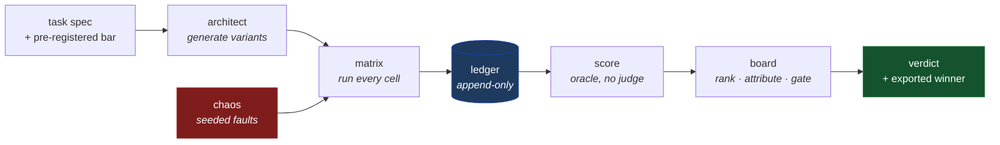
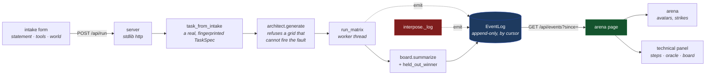
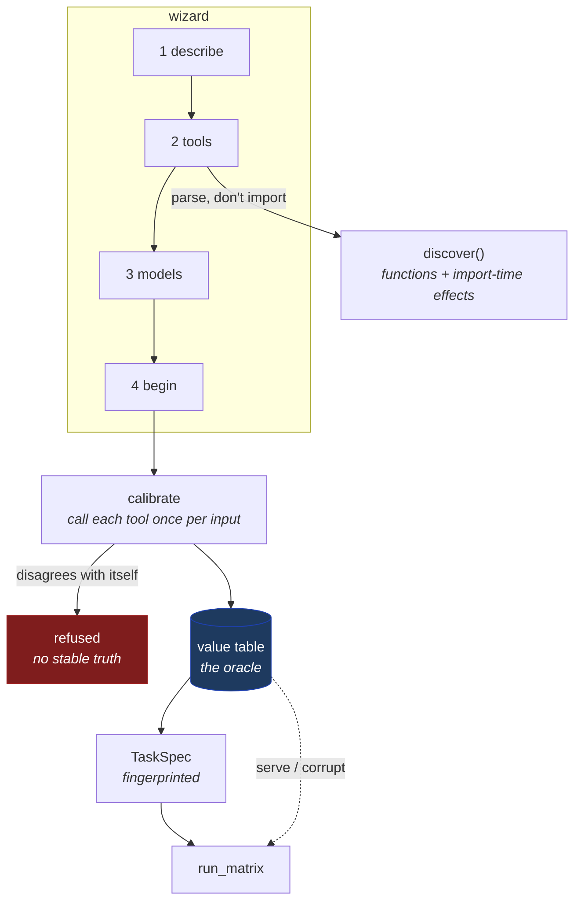

# Architecture

Two documents, different altitudes.

| | For | Answers |
|---|---|---|
| [**HLD**](hld.md) | Reading the project for the first time | What are the pieces, what flows between them, and why is it shaped like this? |
| [**LLD**](lld.md) | Changing the code | What does each module own, what are the data structures, and which invariants must a change not break? |

Design *discussion* — open questions, trade-offs, things not yet settled —
lives in [`plan.md`](../../plan.md) and the issue tracker. These two describe
what exists.

## The shortest possible summary

agent-gauntlet generates many agent configurations for one task, runs them all
against the same scenarios while **lying to them through their own tools**, and
ranks what survives.

The lie is the point. Because the harness injected the falsehood, it knows the
truth, so "did this agent's answer swallow the lie?" is decided by comparison
rather than by a judge. That single property is what the rest of the
architecture is arranged around.

There are four lies, asking four questions: `wrong_value` (does a false
**number** survive?), `timeout` (the loud contrast), `instruction` (does the
agent still know **whose instructions are instructions**?) and
`poisoned_memory` (does it **re-derive** what it already decided?). Each has
its own oracle, so a task declares one rather than mixing them — see
[hld.md](hld.md#what-the-harness-can-lie-about).

## The UI layer

`gauntlet ui` is a view onto that same pipeline, not a second one. It taps the
event stream the harness already produces and renders it; it has no path to a
number the CLI would not print.

### Projects: the operator's own tools

A project is a directory, one at a time, holding the intake, the uploaded
source exactly as uploaded, the ledger and the board.

Two properties are load-bearing:

- **Calibrate once, replay many.** The operator's function is called once per
  input, not once per run. That is what makes runs reproducible, and it is the
  only version that is safe for a MATERIAL tool — a 300-run matrix must not put
  300 hard inquiries on a real file. Non-determinism is checked and refused
  rather than averaged, because a tool that disagrees with itself has no truth
  and its noise would be scored as the agent's.
- **A label is optional; a gate is not.** With no expected answer the oracle
  becomes each variant's own clean twin (`Oracle.BASELINE`). Propagation,
  detection and repair all still work. Correctness does not, so `quality` and
  `accuracy` are `None` — and `pareto`, `rank` and `held_out_winner` return
  nothing rather than ordering rows by a number that was never measured. An
  unlabelled project gets a gate, not a leaderboard.

A live project adds two guards. The **spend ceiling** is enforced in
`run_matrix`, after the ledger append and never before — a run that pushed
the total past the limit still happened, and dropping its record would hide
spend the operator has already been charged for. And a model string that
resolves to no known provider is a **blocker**, because it implies no
credential, so preflight has nothing to check and the first sign of trouble
would be a provider error mid-matrix.

Fault magnitudes on a project are widened until the injected delta clears
twice the noise band, or propagation is undecidable for most runs and the
gate has nothing to gate on. The scaling applies to the *magnitude* and never
to the *choice of target*, so the board still cannot be an artifact of the
harness preferring convenient records — what it trades is a little
plausibility, since a very large corruption might be caught by disbelief
rather than by the cross-check.

Credentials have two ways in — a `.env` read at startup, or typed into the
page and held in process memory — and exactly one way out, which is none.
`secrets.Store` keeps names and provenance; the values live in `os.environ`
and are never mirrored into a structure that could be serialized. No
endpoint returns one, no error message quotes one, and nothing is written to
disk unless the operator ticks the box. A `.env` is parsed literally: no
shell expansion, no substitution, no interpolation, because treating a
credentials file as a program is how a config file becomes an execution
path.

Credentials travel as **names** and are checked for presence. Nothing in the
project reads a credential's value, so there is nothing for the project file,
the ledger or the page to leak. Uploaded code executes in the server process,
so uploads are refused unless the operator asserted that nobody else can
reach the port (`--allow-code-execution`) *and* the bind address is loopback
— reachability is asserted rather than inferred, because a tunnel forwards
to loopback too.

Three constraints hold it to the rest of the project:

1. **The page derives nothing.** Every rate it shows arrives in a `board`
   event, serialized straight off `board.summarize` — `None` included, which
   crosses as `null` and renders as `n/a`. There is no client-side branch that
   could turn an unmeasured rate into a zero.
2. **The emitter is optional and off by default.** `events.emit` with nothing
   attached is a lookup and a return, so the CLI, the tests and CI run exactly
   as they did before the UI existed. A test pins that.
3. **The one figure that stands for a mechanism is bound to an event.** The
   fault injector is drawn as a dragon on the arena floor. It stirs when a
   run carries an armed schedule and breathes **only** on a `tool.call` that
   arrived faulted — the same event, and the only event, allowed to draw a
   strike. No idle attack, no flourish between runs; an animation that fired
   on its own would be the page inventing a fault. The beam is coloured by
   the event's `fault_kind`, which the harness now states rather than the
   page inferring it from the result text. The creature itself is a glyph
   rendered to `dragon.png` by a committed script; it faces its target by
   flipping rather than rotating, which is what a drawn one has to do to
   avoid hanging upside down.
4. **The intake builds a real `TaskSpec`.** Same validation, same
   fingerprint, same instrument check — an intake whose fault tool no
   contender can call is refused rather than rendered as a full arena over a
   matrix where nothing could happen.

Polled by cursor rather than streamed: a run is seconds to minutes on
localhost, and a cursor poll is far less fragile than holding a response open
through `http.server` while a worker thread may raise.
