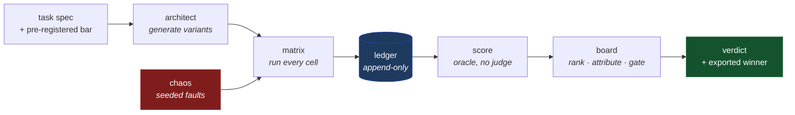

# Architecture

Two documents, different altitudes.

| | For | Answers |
|---|---|---|
| [**HLD**](hld.md) | Reading the project for the first time | What are the pieces, what flows between them, and why is it shaped like this? |
| [**LLD**](lld.md) | Changing the code | What does each module own, what are the data structures, and which invariants must a change not break? |

Design *discussion* — open questions, trade-offs, things not yet settled —
lives in [`plan.md`](../../plan.md) and the issue tracker. These two describe
what exists.

## The shortest possible summary

agent-gauntlet generates many agent configurations for one task, runs them all
against the same scenarios while **lying to them through their own tools**, and
ranks what survives.

The lie is the point. Because the harness injected the falsehood, it knows the
truth, so "did this agent's answer swallow the lie?" is decided by comparison
rather than by a judge. That single property is what the rest of the
architecture is arranged around.

