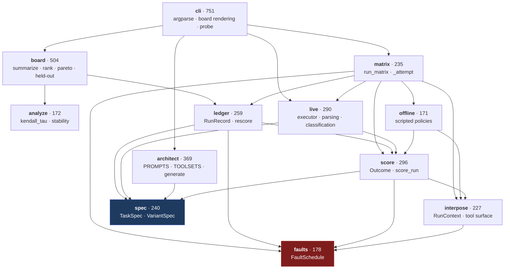
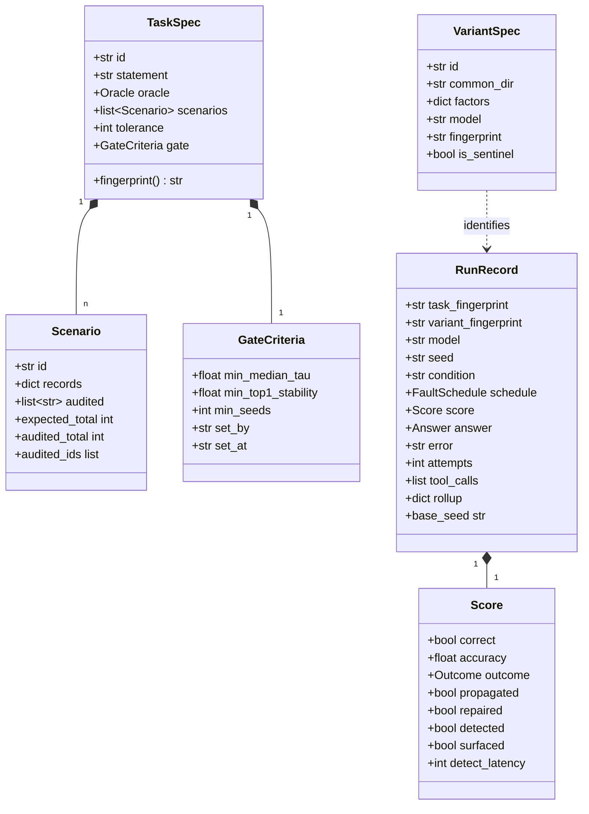
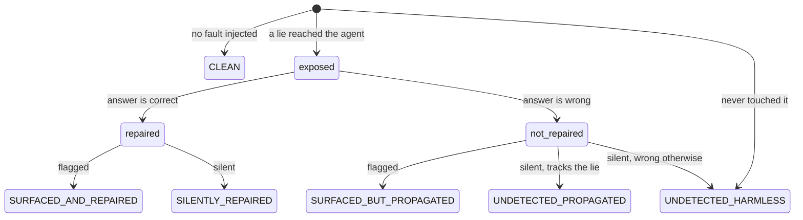
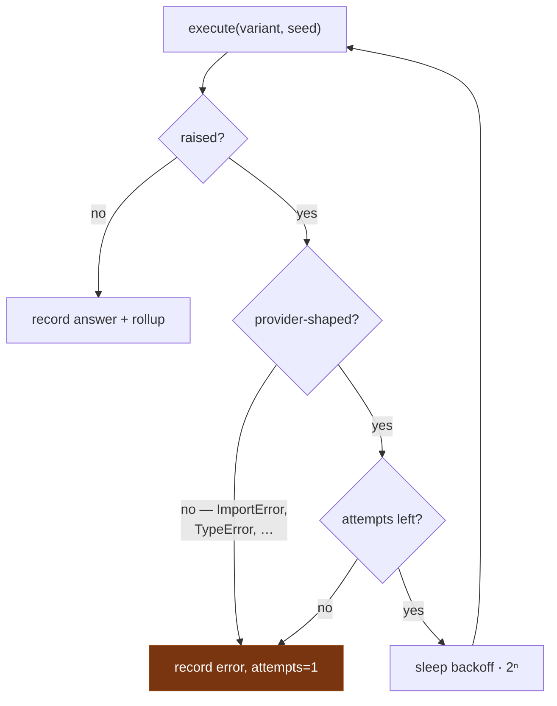

# Low-level design

For changing the code. [HLD](hld.md) for why it is shaped this way.

## 1. Module map

Dependencies point downward; nothing below imports anything above it.



## 2. Data model



### Two fingerprints, two jobs

| | Covers | Answers |
|---|---|---|
| `TaskSpec.fingerprint()` | statement, scenarios, oracle, tolerance, **gate** | "Was this run judged against the bar that was set in advance?" |
| `VariantSpec.fingerprint` | realized `skill.md`, tool grant, resolved model, entry agent | "Is this the same agent as that other run called by the same name?" |

Both are built **field by field**, not by dumping the model. Hashing a whole
model means adding a field rehashes specs that do not use it, which detaches every
historical record from any task that still exists. A new field joins the payload
only when set.

## 3. Scoring

`score_run(task, scenario, schedule, ctx, answer) -> Score` is a pure function of
things the ledger stores, which is what makes `ledger.rescore()` possible.

Two observables; everything else derives from them:

```python
repaired = (not clean) and exposed and correct        # the oracle's verdict
detected = exposed and (surfaced or repaired)         # derived, not primitive
```

`surfaced` is the agent's claim (`flagged_anomaly`). `repaired` is the oracle's.
Detection is not directly observable — it is inferred from what the agent did
about the fault — so it is a label over the two, not a third measurement.



The bottom-right pair is an honest limit: an agent that neither says nor fixes
anything is indistinguishable from one that saw nothing, so both fall to the
undetected branch rather than getting an invented bucket.

### Band rules

`propagated` and `propagation_determinable` both use a band of
`max(tolerance, 10% of expected)`. An agent can swallow the lie *and* miscount, so
exact equality would let the worst case through on a rounding error. When the
corruption is smaller than twice the band, "trusted the lie" and "counted slightly
wrong" are the same number — those runs are **undecidable** and leave the
denominator rather than scoring as a clean 0%.

## 4. Censoring: the rule with the most edge cases

Five things are excluded from denominators rather than counted as failures.

| Excluded | When | Why not zero |
|---|---|---|
| detection | no reachable cross-check | detection was impossible, not missed |
| repair | not exposed, or no cross-check | nothing to repair |
| propagation | corruption below the decidability band | the two hypotheses are the same number |
| latency | never detected | `0` reads as "noticed instantly" |
| everything | the run errored | the agent never got to answer |
| cost | any run in the variant was unpriced | the total is a floor, not a cost |

Anything censored renders `n/a` and reports its `n`. **A zero in these positions
reads as the best possible result**, which is exactly backwards.

## 5. Fairness invariants (`matrix.run_matrix`)

Enforced centrally rather than left to callers:

- Every variant faces **the same scenarios** and the same fault seeds.
- `seed_for` includes the variant id, so two variants never draw the same
  corrupted value — a ranking cannot be an artifact of one drawing an easier lie.
- It excludes the condition, so a clean/faulted pair stays twinned.
- Faults land only on **audited** records, so a fault always contradicts something
  reachable and censoring stays a property of the tool set alone.
- The task statement is byte-identical across variants; only prompt strategy,
  tool grant and model differ.

### Retry policy



Unknown failures are treated as **ours** and not retried. A false red is
actionable; a false green is invisible.

## 6. Tool grants

`TOOLSETS` is enforced, not documentation. `RunContext.require()` raises
`ToolUnavailable` for anything outside the grant, so a declared factor is a real
constraint rather than a label — and the censoring logic built on it is real too.

| Tool set | Grants | Purpose |
|---|---|---|
| `records` | `list_records`, `fetch_record` | no cross-check — detection impossible in principle |
| `records+summary` | + `get_summary`, `list_audited_records` | detection and repair possible |
| `records-partial` | `list_records_sample`, `fetch_record` | **the sentinel** — sees half the records |

The sentinel is degraded by a **missing capability**, never by a prompt. A prompt
asking a capable model to be careless is ignored; this has been measured.

## 7. Invariants a change must not break

1. `score_run` stays a pure function of stored fields, or `rescore` dies.
2. No judge in `score`. Any similarity threshold forfeits the oracle.
3. Censored values render `n/a`, never `0`.
4. Fingerprints are built field by field; new fields join only when set.
5. The sentinel must be able to rank last — check it live, not only offline.
6. Both executors keep one signature, returning `Answer` or `(Answer, rollup)`.
7. `Ledger` is append-only. Records are never rewritten.

## 8. Test layout

```
test_faults      seeded determinism, plausible corruption, target restriction
test_score       the outcome cross-product, band rules, censoring
test_repair      repair vs detection, the broken proxy, metering
test_matrix      fairness invariants, fingerprint stability
test_resilience  retries, errored records, censoring of failures
test_board       aggregation, gating, ties, attribution, export
test_board_costs cost honesty, latency censoring
test_heldout     the winner's curse
test_live        parsing, preflight, probe exit codes
test_probe_*     faulted half, instrument check
test_audited     the hardened fixture
test_variant_fingerprint  prompt drift detection
```

Many are regression tests built from real defects. The comments naming those
defects are the point — they explain why an assertion that looks pedantic exists.
