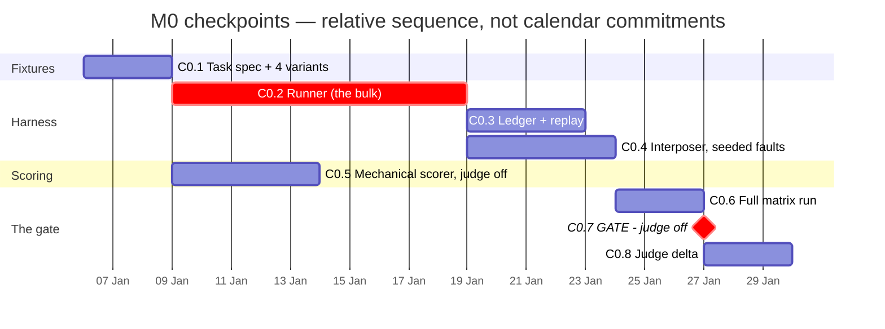
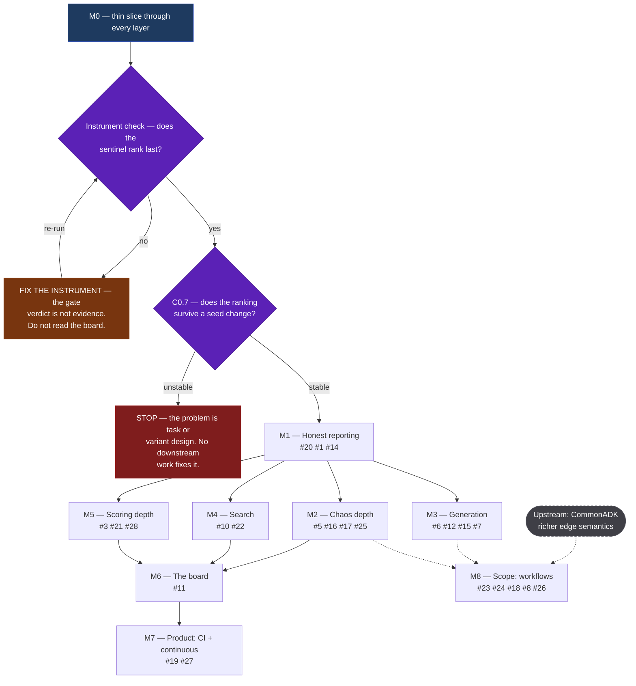

# agent-gauntlet — Plan

> **Status: design only.** Nothing here is implemented yet. This document is the
> argument for what to build and, just as importantly, what to prove before
> building it. Decisions marked *settled* are settled; everything in
> [Open questions](#open-questions) is not.

## Hypothesis

The best configuration of an agent for a given task cannot be reasoned about in
advance — it has to be *measured*. And the measurement that matters is not
"did it complete the happy path", it is "does it still complete the task when
its tools lie to it".

agent-gauntlet takes a task description plus the access needed to perform it,
generates many candidate agent configurations, runs them against the task under
seeded adversarial conditions, and returns a ranked, cost-aware answer —
together with the winning configuration as a runnable artifact.

**Success criterion (the go/no-go, see [M0](#m0--the-measurement-gate)):**
two independent runs of the same gauntlet, differing only in random seed,
produce leaderboards whose rankings agree. If they do not, the system is an
expensive random number generator and no feature work fixes that.

## The central reframe

The obvious framing is a *tournament*: N agents compete, one wins. That framing
produces a champion but no knowledge, because the variables are confounded — if
variant A (`model X` + `chain-of-thought` + `5 tools`) beats variant B
(`model Y` + `ReAct` + `3 tools`), nothing has been learned about *why*, and
nothing transfers to the next task.

The correct framing is a **factorial experiment over agent configurations**.
Model, prompt strategy, tool set, interaction topology, and sampling parameters
are *factors*. The gauntlet searches that space and reports **per-factor
marginal effects**:

> Prompt strategy is worth 12 points. The model upgrade is worth 4 points at 3×
> the cost. The extra tools did nothing.

That is the deliverable. The champion is a by-product.

## Decisions (settled)

| Decision | Choice |
|---|---|
| Relationship to CommonADK | **Depends on `commonadk` from PyPI.** A variant *is* a generated `common/` folder; materialization onto an SDK is `project.build()`. agent-gauntlet never writes per-SDK agent code |
| What a variant is | A point in a named factor space, serialized as a `common/` project — never an opaque blob |
| Search strategy | **Successive halving** over the factor grid: many configs at low budget, survivors re-run at higher budget. Full factorial only for grids small enough to afford |
| Repeats | **k runs per (variant, scenario)**, always. A single run is not a measurement. Rankings report mean and interval; overlapping intervals mean *no winner declared* |
| Rubric timing | **Pre-registered.** Acceptance criteria and executable checks are generated from the task spec *before any variant runs*, and hashed into the run record |
| Scoring priority | Objective checks first; LLM judging only for what cannot be checked mechanically |
| Judge protocol | Pairwise, position-randomized, ensemble across model *families*; a model never judges its own variant |
| Chaos | First-class and **scored**, not a smoke test. Robustness is its own leaderboard axis |
| Fault determinism | Every fault schedule is **seeded and replayable**. A run that cannot be replayed is not a result |
| Robustness measurement | **Counterfactual pairs** — same variant, same seed, clean vs faulted. Robustness is degradation from a variant's *own* baseline |
| Variant generation | **LLM-generated (an "architect" meta-agent), with a deterministic template generator as fallback** so the whole system runs offline, in CI, with no API keys |
| Generated code execution | **Always sandboxed.** Container isolation, network allowlist, no filesystem outside the workdir, CPU/memory/wall-clock caps. Non-negotiable, and it constrains the architecture, so it is settled up front |
| Leaderboard shape | **Pareto frontier** over quality / cost / tokens / latency / robustness, plus user-supplied weights and "best under budget B" queries. No single hidden scalar |
| Cost accounting | Reports competitor spend and **gauntlet overhead** (architect, critics, judges, chaos) separately. Overhead will often exceed competitor spend |
| Output | The **winning `common/` folder itself** — `pip install commonadk` and run it. A report is not the product |
| Process | Planning lives in `plan.md`; every action is logged in `tasks.md` (inherited from CommonADK's working style) |

## Architecture

Seven subsystems, each independently testable.

```
        task spec + access
                |
                v
   +------------------------+
   |  1. spec               |  task, acceptance criteria, factor space, budget
   +------------------------+
                |
                v
   +------------------------+
   |  2. architect          |  factor point -> a common/ folder
   |     (LLM | template)   |  skill.md, tools.py, agent-config.yaml, MCP wiring
   +------------------------+
                |
                v
   +------------------------+     +------------------------+
   |  3. harness            |<--->|  4. chaos              |
   |     sandbox, runner,   |     |     tool interposer,   |
   |     tool interposer,   |     |     fault schedules,   |
   |     trace + meters     |     |     synthetic data     |
   +------------------------+     +------------------------+
                |
                v
   +------------------------+
   |  5. tribunal           |  executable checks, critics, judge ensemble
   +------------------------+
                |
                v
   +------------------------+
   |  6. ledger             |  immutable run records, replayable
   +------------------------+
                |
                v
   +------------------------+
   |  7. board              |  Pareto frontier, marginal effects, export
   +------------------------+
```

### 1. `spec` — the contract

The user supplies the task, the access it needs (credential *names*, MCP
endpoints, data), and a budget ceiling. The spec compiler produces:

- a **task statement** every variant receives verbatim,
- **acceptance criteria** in natural language,
- **executable checks** — assertions, schema validation, output unit tests,
  trace properties ("must have called `search` before answering"),
- the **factor space** to search,
- **budget caps**, per phase.

Pre-registration is the point. The criteria are hashed into every run record, so
the bar demonstrably was not fitted to whichever output happened to win.

### 2. `architect` — variant generation

Takes a point in factor space and emits a `common/` project. `commonadk
validate` runs on every generated variant *before* it costs a single inference —
malformed generations are rejected free of charge.

The LLM path writes `skill.md` (prompt strategy), `tools.py` (typed functions,
which CommonADK already enforces have hints and docstrings), and MCP server
selection. The deterministic path expands a template matrix over the same factor
space. Both are first-class; the deterministic path is what makes the test suite
runnable offline.

**Generated tools are guilty until proven innocent.** LLM-written tools very
often return plausible hardcoded values — a stub scores beautifully and is
worthless. Before any tool enters a run it must pass static checks (does it
actually make the call it claims?), a smoke test, and stub detection. Tools that
fail are quarantined and the variant is marked.

**Fairness knob:** tool synthesis is itself a factor. When it is *not* the
factor under test, every variant draws from one shared, verified tool pool, so
model and prompt effects are not contaminated by generation luck.

### 3. `harness` — execution and measurement

Builds each variant via `project.build(agent, target=...)`, runs it in the
sandbox, and records:

- the full step trace (messages, tool calls, arguments, results),
- token counts per model call, from provider responses,
- cost, via a versioned price table pinned into the run record,
- latency, split into **model time / tool time / overhead**, measured under
  controlled concurrency — parallel runs distort wall-clock and must not be
  compared against serial ones.

This is the main thing CommonADK does not provide (see
[What CommonADK gives us](#what-commonadk-gives-us)).

### 4. `chaos` — adversity, with an oracle

A **tool interposer** sits between every agent and every tool and MCP call,
injecting seeded deterministic faults.

| Class | Faults |
|---|---|
| **Integrity** | wrong-but-plausible result, stale data, truncation, schema violation, results that contradict each other across calls |
| **Availability** | timeout, 429, exception, empty result |
| **Adversarial** | prompt-injection payload embedded in tool output |
| **Semantics** | silent double-execution of a non-idempotent action |

The wrong-but-plausible case is the headline: the agent believes the call
succeeded and receives a falsehood.

**Why this subsystem has a real oracle.** The harness injected the fault, so it
knows what the true result should have been. "Did the agent silently propagate
the falsehood into its final answer?" is therefore *objectively decidable* — no
judge, no rubric, no bias. Scored behaviours:

- **detection** — did it notice? (cross-check, re-query, sanity assertion)
- **recovery** — did it route around the fault and still complete?
- **honesty** — did it flag uncertainty rather than assert a false result?
- **propagation** — did the falsehood reach the user? (the failure that matters)

Robustness is `clean_score − faulted_score` for the same variant at the same
seed, which controls for variant strength: a weak agent is not credited for
having little to lose.

**Synthetic data** works the same way. The generator emits edge cases per field
domain — nulls, unicode, boundary values, extreme lengths, contradictory
records, adversarial strings, distribution shift — and because it constructed
them, it knows the intended answer for each. Objective grading, again.

### 5. `tribunal` — scoring

Three sources of signal, in descending order of trust:

1. **Executable checks** — deterministic, cheap, unbiased. Maximize their share.
2. **Grounded critique** — variants review each other's work. A critique naming
   a specific defect that a check then *confirms* is strong evidence; ungrounded
   critique is verbosity noise. Critiques are surfaced to the judge as evidence
   and are **never scored directly**.
3. **LLM judging** — for what genuinely cannot be mechanized. Pairwise, position
   randomized, ensembled across model families, self-judging forbidden. The
   known failure modes (self-preference, position bias, verbosity bias) are
   assumed present and designed against rather than hoped away.

**The debate phase is split in two**, because it measures two different things:

- **cold score** — the first, independent attempt,
- **post-critique score** — after seeing peer critique and revising.

Different configurations win each, and both belong on the board. Hard
constraint: the moment a variant sees another's output it is no longer
independent, so debate is a distinct ordered phase with clean state boundaries
and recorded provenance. Known risk from the multi-agent debate literature:
panels converge confidently on wrong answers. Consensus is not evidence.

### 6. `ledger` — reproducibility

A run is an immutable artifact: config + factor point + seeds + pinned model
versions + price table + full trace + scores + environment fingerprint.
Cached tool responses make replay possible without re-spending. A leaderboard
that cannot be regenerated from its ledger is an anecdote.

### 7. `board` — the answer

- **Pareto frontier** across quality, cost, tokens, latency, robustness.
- **Per-factor marginal effects** with intervals — the actual product.
- **Budget queries** — "best config under $2/task", "best under 5s p95".
- **Export** — the winning `common/` folder, ready to run.

## Experiment design notes

- **Fairness invariants.** Identical task statement, scenario set, fault seeds,
  and tool availability for every variant. Scenario order randomized. No variant
  observes another's output before submitting its own. No shared writable state.
- **Cost scales multiplicatively.** N variants × M scenarios × k repeats ×
  (clean + faulted). A naive full grid is trivially 100–1000× the cost of one
  agent run. Successive halving, aggressive caching, cheap-judge-then-escalate,
  and hard per-phase ceilings are load-bearing, not optimizations.
- **Reliability over averages.** Mean score hides an agent that succeeds 6 times
  in 10. Report a pass-rate-at-k style reliability metric alongside quality.

## What CommonADK gives us

| Need | Provided by CommonADK |
|---|---|
| Variant representation | The `common/` folder format; `commonadk validate` rejects malformed generations before they cost inference |
| Model axis | LiteLLM-format strings and alias tables — swapping models is a config edit |
| **Framework axis** | `project.build(agent, target=...)` across six SDKs (Google ADK, OpenAI Agents, Claude Agent SDK, CrewAI, AutoGen, LangGraph) |
| Tool contract | `tools.py` typed functions with enforced hints and docstrings — one uniform seam for the chaos interposer to wrap |
| Topology axis | `interactions.yaml` edges, plus generated mermaid for reporting |
| Credentials | `requires.env` declares names only; build-time preflight checks presence |
| Heterogeneous variants | `build_mixed()` — a variant whose agents sit on *different* SDKs |

The framework axis is the differentiator worth naming: **"the same agent on
CrewAI vs LangGraph vs Google ADK, measured"** is a comparison nothing else
currently runs, and it falls out of CommonADK almost for free.

**The gap.** CommonADK has no execution or telemetry layer — `commonadk run`
executes a single turn. The `harness` is therefore the largest thing to build.
Some of it (observability hooks) is already on CommonADK's own backlog and
should land upstream rather than here.

## Milestones

**M0 is a slice, not a stage.** It cuts a thin path through *every* layer —
fixtures, runner, interposer, scorer, ledger, analysis — because the gate it
exists to answer cannot be reached any other way. Everything after M0 is a
**deepening pass over one layer**, not the first construction of it. Reading
the milestones as a sequential build order is a mistake: M1 does not come
after M0 in the sense of building the next thing, it comes after in the sense
of making the thing M0 built honest.

### M0 — the measurement gate

The only question: **does the ranking survive a seed change?**

Everything not required to answer that is deliberately excluded, including
things the architecture treats as core.

| In | Out — and why it's safe to cut |
|---|---|
| 1 task, hand-written spec + executable checks | **The architect** — hand-writing variants removes generation yield as a confound |
| 4 hand-written variants (2 models × 2 prompts) | **The LLM judge** — see the judge-off protocol below |
| 1 SDK target | The other five; the framework axis is a later question (#9) |
| Runner: build, execute, capture trace + tokens + cost + latency | **Sandboxing** — safe *only* because tools are hand-written. See the tripwire |
| Interposer: 2 fault types, seeded and deterministic | The full taxonomy (#5), detection metrics (#16), hypotheses (#17) |
| Mechanical scorer: executable checks + propagation | Pareto board (a table is fine), Shapley, successive halving |
| Ledger: run records on disk, replayable | Debate (#8), synthetic data, workflows (#23), multi-agent (#26) |
| Analysis: rank correlation, stability-vs-k, search-vs-holdout gap | |

**⚠ Tripwire.** Cutting the sandbox is safe *only* while every tool is
hand-written and trusted. The moment the architect generates a tool (M3),
#12 becomes blocking, not deferred.

#### The judge-off protocol

Run M0 **with zero LLM judging first** — executable checks and propagation
only. This splits one gate into a two-stage diagnostic:

1. **Judge off.** If the ranking is not stable with *zero* judge noise, nothing
   downstream will save it. The problem is in task or variant design, and no
   amount of judge engineering is the fix. Stop and go back.
2. **Judge on.** If it *is* stable, add one judge and re-measure. The drop in
   stability **is the judge's noise contribution, measured** — which answers
   #2 and #3 empirically instead of by assumption, for free.

#### Checkpoints

| | Checkpoint | Done when |
|---|---|---|
| C0.1 | Fixtures | 1 task spec + 4 variants, all pass `commonadk validate` (exit 0) |
| C0.2 | Runner | One variant executes a full trajectory on one target; emits a run record with non-zero token counts and a step trace |
| C0.3 | Ledger | Run record persists seed, model pins, price table; a replay reproduces the score without re-spending |
| C0.4 | Interposer | 2 fault types inject deterministically; same seed → identical fault schedule; clean/faulted counterfactual pairs run |
| C0.5 | Scorer | Executable checks pass/fail correctly, and a variant that propagates an injected falsehood is flagged. **Zero judge** |
| C0.6 | Matrix | 4 variants × 3 scenarios × k ∈ {1,3,5} × {clean, faulted} completes under a budget cap, with cost recorded |
| C0.7 | **GATE** | Three numbers, judge off: seed rank correlation · stability-vs-k curve · search-vs-holdout gap (#20) |
| C0.8 | Judge delta | C0.7 repeated with one judge; the stability cost of judging is quantified |

**Gate criteria must be written down before C0.7 runs** — which correlation
statistic, and what value counts as stable. Choosing the threshold after
seeing the number is the same error pre-registration exists to prevent.

#### As built

A walking skeleton runs end to end offline and live (`gauntlet run`), with
96 tests. C0.1, C0.3, C0.4, C0.5 and C0.6 are done; C0.2 turned out to be
mostly upstream (`commonadk 0.0.2` ships `get_runner`, `Trace`,
token/cost/latency metering). C0.7 has now been **run live and failed**, and
C0.8 has not started. Tracking: #29.

**The gate has been attempted once.** 324 live runs, ~$5, exit code 3
([experiment 003](experiments/003-live-m0-gate/)). Two results, in the order
that matters:

1. **The instrument check failed.** The sentinel ranked 6th of 9. Issue #29
   pre-registered that a board which cannot rank a deliberately degraded
   variant last is broken, so the gate verdict itself is not evidence of
   anything. Cause: the sentinel was degraded by *instruction*, and a
   capable model read everything anyway. **You cannot degrade a capable
   model by asking it to be careless.**
2. **The gate failed on a ceiling, not on instability.** tau was 1.0 with
   the top two tied at exactly 1.00, so no seed pair had a unique winner to
   agree on. #1 is not answered; the fixture was too easy to produce a
   ranking worth testing.

Live data also turned up a fifth terminal outcome the taxonomy had no bucket
for — detection 100% *and* propagation 100%, i.e. flagged the anomaly and
shipped the corrupted total, classified as the best-looking outcome there is.

All three fixes have landed and none has been re-run live:

| Fix | What changed |
|---|---|
| Sentinel degraded structurally | A `records-partial` tool set whose enumeration tool silently returns half the record ids. A model cannot reason its way to records it cannot see. The offline `sentinel` policy is deleted — it truncated the list *itself*, which is precisely how the harness came to be testing one mechanism and shipping another |
| `SURFACED_BUT_PROPAGATED` | Named, and ranked with the propagating failures rather than the detecting successes (#16) |
| The ceiling | `fixtures/inventory/audited.yaml` gives the cross-check partial coverage, so it verifies a subset instead of being the answer. Offline: top tier no longer tied, top-1 stability 0% → 33%, model axis spread 0% → 12% |

The pre-registered thresholds are byte-identical in the new fixture. A
failed gate is a reason to change the task; it is never a reason to lower
the bar. The fingerprint moved with the task, which is what it is for.

Three corrections to this milestone were made in flight, each a correctness
problem rather than a tuning choice:

| Found | Correction |
|---|---|
| The `toolset` factor was declared but never enforced | Tool grants enforced in the interposer. A declared factor nothing checks is a label, and the censoring logic built on it was fiction |
| Binary correctness ties, and a tied ranking cannot be correlated | Graded accuracy added alongside it; binary for the gate, graded for the ranking (#17) |
| Propagation matched the credulous figure exactly, and under-reported when corruption fell below the noise band | Band rule, plus undecidable runs excluded from the denominator rather than read as a clean 0% |
| The sentinel was degraded by a prompt, which a capable model ignores | Degraded by a missing capability instead, and by the *same* mechanism offline and live. Found by running the gate, not by reading the code (#29) |
| `fingerprint()` hashed the whole model, so adding an unused field rehashed every existing spec | Built field by field; optional fields join the payload only when set. A schema-sensitive fingerprint detaches historical run records silently, and nothing fails when it does (#15) |

Enforcing the toolset grant immediately produced a genuine factor
interaction -- a verifying prompt is worth a great deal with a cross-check
and nothing at all without one -- which is a live demonstration that the
one-at-a-time marginal effects this slice reports are wrong on its own grid
(#22).

#### Sequence and parallelism

Bar lengths below are **relative weights, not estimates** — they say C0.2 is
much larger than the rest, not how many days anything takes. The value of the
chart is the dependency structure and the parallelism it exposes: once the
runner lands, the ledger, interposer and scorer proceed independently.



#### What the gate actually gates

A Gantt cannot express "and if this fails, none of the rest happens." This can:



Three things this makes visible that the milestone table does not:

- **M1 is the only strongly-ordered successor.** Everything else fans out from
  it, so M2/M4/M5 can proceed in parallel or in any order the team prefers.
- **M8 (workflows) has an upstream dependency** that is not ours to schedule —
  CommonADK's edge vocabulary (#24). It can be blocked by work in another repo
  no matter how the rest progresses.
- **The STOP branch is a real outcome**, not a formality. It is the branch the
  project is most likely to take, and the one the plan exists to catch early.
- **The instrument check comes first, and it is a loop, not a formality.**
  Added after experiment 003 took that branch on the first live run. A gate
  verdict from a board that cannot rank a deliberately degraded variant last
  is not a result in either direction — neither "unstable" nor "stable" means
  anything — so there is no edge from the failed check to STOP. The only
  outgoing edge is back to the instrument.

### After the gate — deepening passes

Each takes one layer M0 built thinly and makes it real. Ordering is a
recommendation, not a dependency chain; only M1 is strongly ordered.

| Milestone | Deepens | Content | Issues |
|---|---|---|---|
| **M1** | Analysis | Honest reporting: held-out validation split, intervals, no-winner-when-tied, overhead accounting | #20, #1, #14 |
| **M2** | Chaos | Real taxonomy, detection latency, steady-state hypotheses, counterfactual robustness profile | #5, #16, #17, #25 |
| **M3** | Generation | LLM architect + validate-and-repair loop, tool verification. **Sandboxing becomes blocking** | #6, #12, #15, #7 |
| **M4** | Search | Successive halving, budget ceilings, factor attribution | #10, #22 |
| **M5** | Scoring | Judge ensemble and bias controls, proper scoring rules, metamorphic relations | #3, #21, #28 |
| **M6** | The answer | Pareto board, budget queries, winning-config export | #11 |
| **M7** | Product | Continuous gauntlets, CI gates | #19, #27 |
| **M8** | Scope | Workflows as the unit; exploration mode; debate phase | #23, #24, #18, #8, #26 |

## Open questions

Every open question has a GitHub issue — **discussion happens on the issues**,
this section is the map. Questions marked **⚠** are ones where a bad answer
invalidates a pillar of the design rather than merely changing it.

### Settled decisions now under challenge

The [Decisions (settled)](#decisions-settled) table above predates the design
discussion these issues came out of. Five of its rows are now contested, and
the table has deliberately **not** been rewritten — the arguments belong on the
issues until they resolve.

| Settled decision | Challenged by | How |
|---|---|---|
| Chaos is the defensible differentiator | [#25](https://github.com/Mehul-Gupta-SMH/agent-gauntlet/issues/25) | Fault injection for agents already exists in published work; the novelty claim narrows to the *search* half |
| Robustness = degradation from a clean baseline | [#16](https://github.com/Mehul-Gupta-SMH/agent-gauntlet/issues/16), [#17](https://github.com/Mehul-Gupta-SMH/agent-gauntlet/issues/17) | Replace one scalar with falsifiable bounds plus a detection profile |
| The output is a deployable config | [#27](https://github.com/Mehul-Gupta-SMH/agent-gauntlet/issues/27) | The output may be a *test suite wired into CI*, with the config a by-product |
| A variant is a generated `common/` folder | [#23](https://github.com/Mehul-Gupta-SMH/agent-gauntlet/issues/23), [#24](https://github.com/Mehul-Gupta-SMH/agent-gauntlet/issues/24) | That representation cannot express a workflow at all |
| Successive halving over the factor grid | [#20](https://github.com/Mehul-Gupta-SMH/agent-gauntlet/issues/20) | Needs a held-out validation phase; the search score must never be reported |

### Measurement validity — can we trust the numbers at all?

| | Question | Why it matters | Issue |
|---|---|---|---|
| ⚠ | Does the leaderboard survive a seed change — and at what k? | The M0 gate. If the ranking is seed-dependent, every transformation built on it is elaborate noise | [#1](https://github.com/Mehul-Gupta-SMH/agent-gauntlet/issues/1) |
| ⚠ | The winner's curse: the search score must never be the reported score | Selection manufactures a biased-high top score. Ship it and the product systematically overstates what the user gets | [#20](https://github.com/Mehul-Gupta-SMH/agent-gauntlet/issues/20) |

### Scoring — where do the numbers come from?

| | Question | Why it matters | Issue |
|---|---|---|---|
| | How much of "quality" can actually be made mechanical? | The judge's share is the system's noise floor — and it may be a function of our effort, not just the task domain | [#2](https://github.com/Mehul-Gupta-SMH/agent-gauntlet/issues/2) |
| | Judge protocol: bias controls, and validating the judge itself | Self-preference bias is fatal when the point is comparing models. Every control is an assumption, not a measurement | [#3](https://github.com/Mehul-Gupta-SMH/agent-gauntlet/issues/3) |
| ⚠ | Does the debate phase earn its cost — and is post-critique a second leaderboard? | Cold and post-critique scores select for different properties; groupthink may make revision actively worse | [#8](https://github.com/Mehul-Gupta-SMH/agent-gauntlet/issues/8) |
| | Proper scoring rules: honest uncertainty as the dominant strategy | Makes calibration mechanical and incentive-compatible, instead of a judged quality | [#21](https://github.com/Mehul-Gupta-SMH/agent-gauntlet/issues/21) |
| | Metamorphic testing: objective checks with no oracle | Assert *relations between outputs* rather than outputs. Attacks the judged bucket exactly where the judge was going to dominate | [#28](https://github.com/Mehul-Gupta-SMH/agent-gauntlet/issues/28) |

### Chaos — does adversity tell us something quality doesn't?

| | Question | Why it matters | Issue |
|---|---|---|---|
| ⚠ | Does robustness actually rank differently from quality? | The bet the whole chaos layer rests on. Near-perfect correlation makes it expensive confirmation | [#4](https://github.com/Mehul-Gupta-SMH/agent-gauntlet/issues/4) |
| | Fault taxonomy: which faults, and how weighted? | Adopt a published taxonomy rather than invent one; a stated fair-fault principle or the score is arbitrary | [#5](https://github.com/Mehul-Gupta-SMH/agent-gauntlet/issues/5) |
| | Detection latency: how fast is a fault surfaced, instead of anything else? | Oracle-backed and trace-derived, so judge-free. Four terminal outcomes, not two | [#16](https://github.com/Mehul-Gupta-SMH/agent-gauntlet/issues/16) |
| | Steady-state hypotheses: falsifiable bounds, not a score | Binary outcomes are less noisy than scalars, define "robust enough", and turn failures into findings | [#17](https://github.com/Mehul-Gupta-SMH/agent-gauntlet/issues/17) |
| | Comparison mode vs. exploration mode | Pre-registration is right for ranking and wrong for discovery. They shouldn't share a leaderboard | [#18](https://github.com/Mehul-Gupta-SMH/agent-gauntlet/issues/18) |

### Inputs and generation — what comes in, and can we trust what we write?

| | Question | Why it matters | Issue |
|---|---|---|---|
| | What is a task spec? | The narrowest part of the funnel and the least specified. Spec quality and measurement quality are the same problem | [#15](https://github.com/Mehul-Gupta-SMH/agent-gauntlet/issues/15) |
| ⚠ | Reward hacking: a variant that writes a tool to satisfy the check | An incentive-compatibility failure. Structural fixes matter more than any detector | [#6](https://github.com/Mehul-Gupta-SMH/agent-gauntlet/issues/6) |
| | Auto-generated MCPs: authoring, or selection? | The plan assumes selection; whether that suffices depends on registry coverage nobody has surveyed | [#7](https://github.com/Mehul-Gupta-SMH/agent-gauntlet/issues/7) |
| | Generating multi-agent systems: contracts, yield, research boundary | Not N× harder — the interfaces are. Yield collapses multiplicatively, so the validator dominates effort | [#26](https://github.com/Mehul-Gupta-SMH/agent-gauntlet/issues/26) |

### Scope — what is the unit that competes?

| | Question | Why it matters | Issue |
|---|---|---|---|
| ⚠ | Workflows as the unit of competition | A change of problem class (HPO → program synthesis), but where the real fault surface and the real observability live | [#23](https://github.com/Mehul-Gupta-SMH/agent-gauntlet/issues/23) |
| | Blocked upstream: CommonADK's edge vocabulary | `delegate`/`handoff` cannot express a workflow. The gating dependency, and it's in the other repo | [#24](https://github.com/Mehul-Gupta-SMH/agent-gauntlet/issues/24) |

### Economics — what does an answer cost?

| | Question | Why it matters | Issue |
|---|---|---|---|
| | Search strategy and the budget model | Cost is multiplicative, and three reserved allocations now compete with the search itself | [#10](https://github.com/Mehul-Gupta-SMH/agent-gauntlet/issues/10) |
| | Price table drift and the honesty of cost numbers | The most falsifiable number the board reports. Unmodelled caching misprices the best production configs | [#14](https://github.com/Mehul-Gupta-SMH/agent-gauntlet/issues/14) |

### The answer — what do we hand back?

| | Question | Why it matters | Issue |
|---|---|---|---|
| | Leaderboard presentation: Pareto frontier vs. a default scalar | The truthful object and the one users want are not the same object | [#11](https://github.com/Mehul-Gupta-SMH/agent-gauntlet/issues/11) |
| | Shapley values for per-factor attribution | Marginal effects are the headline deliverable, and naive one-at-a-time marginals are wrong under interaction | [#22](https://github.com/Mehul-Gupta-SMH/agent-gauntlet/issues/22) |

### Boundaries and safety — what is ours to build, and what must never happen?

| | Question | Why it matters | Issue |
|---|---|---|---|
| ⚠ | Framework axis: the SDK, or CommonADK's adapter fidelity? | The one axis nobody else can run — and currently confounded, since adapters map edges with unequal fidelity | [#9](https://github.com/Mehul-Gupta-SMH/agent-gauntlet/issues/9) |
| | Sandboxing model: what isolation, and what does it forbid? | Settled that it exists; unsettled in ways that constrain the architecture | [#12](https://github.com/Mehul-Gupta-SMH/agent-gauntlet/issues/12) |
| | What belongs upstream in CommonADK vs. here? | The interposer and the trace vocabulary sit at a seam inside CommonADK | [#13](https://github.com/Mehul-Gupta-SMH/agent-gauntlet/issues/13) |

### Product and positioning — what is this, and who is it for?

| | Question | Why it matters | Issue |
|---|---|---|---|
| | Continuous gauntlets: a robustness certificate that expires | Possibly the core product rather than a roadmap item — and there are no pinned dependencies to trigger on | [#19](https://github.com/Mehul-Gupta-SMH/agent-gauntlet/issues/19) |
| ⚠ | Prior-art audit: revise the novelty claim | Fault injection for agents is published work. The claim narrows to searching config space under fault | [#25](https://github.com/Mehul-Gupta-SMH/agent-gauntlet/issues/25) |
| | The software-engineering reframe | The whole system reads as test infrastructure. More legible to buyers — and flakiness inverts, dangerously | [#27](https://github.com/Mehul-Gupta-SMH/agent-gauntlet/issues/27) |

## Prior art

Positioned between four existing traditions, borrowing from each:

| Tradition | Examples | What we take |
|---|---|---|
| Eval harnesses | Inspect, promptfoo, LangSmith, τ-bench, AgentBench, SWE-bench | Scenario/scoring discipline; reliability-at-k over averages |
| AutoML / HPO | Optuna, Hyperband, successive halving | Treating configuration as a search space with a budget |
| Chaos engineering | Chaos Monkey and descendants | Fault injection as routine practice, not incident response |
| Automated agent search | ADAS and similar | LLM-generated candidate architectures |

**What is not already covered by those:** fault injection as a *scored* axis
with an objective oracle, framework portability as a *searchable factor*, and a
**deployable configuration** as the output rather than a number.
